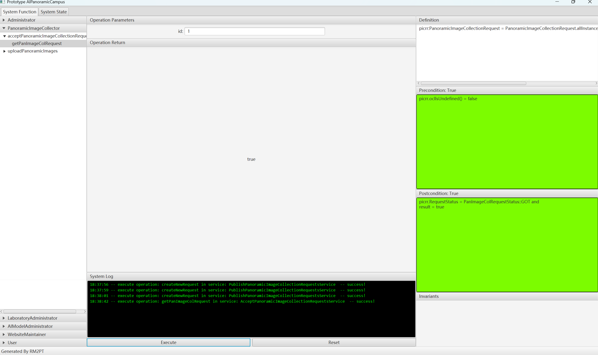
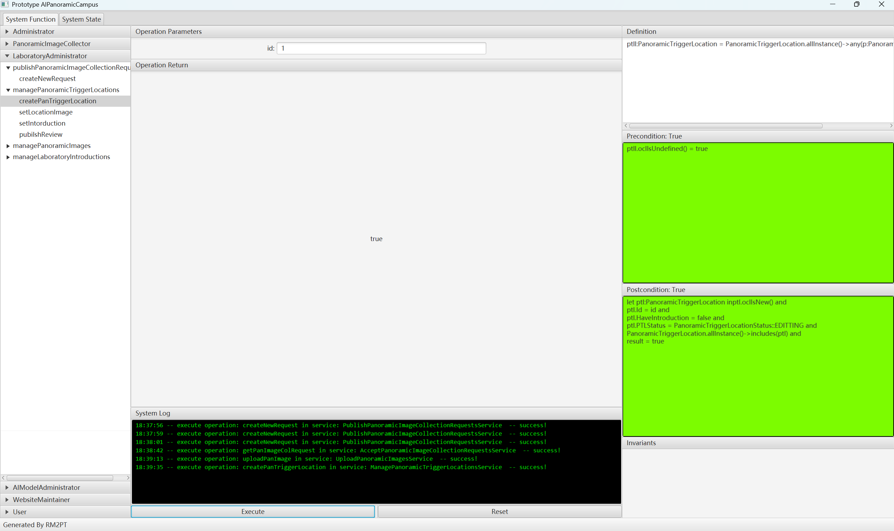
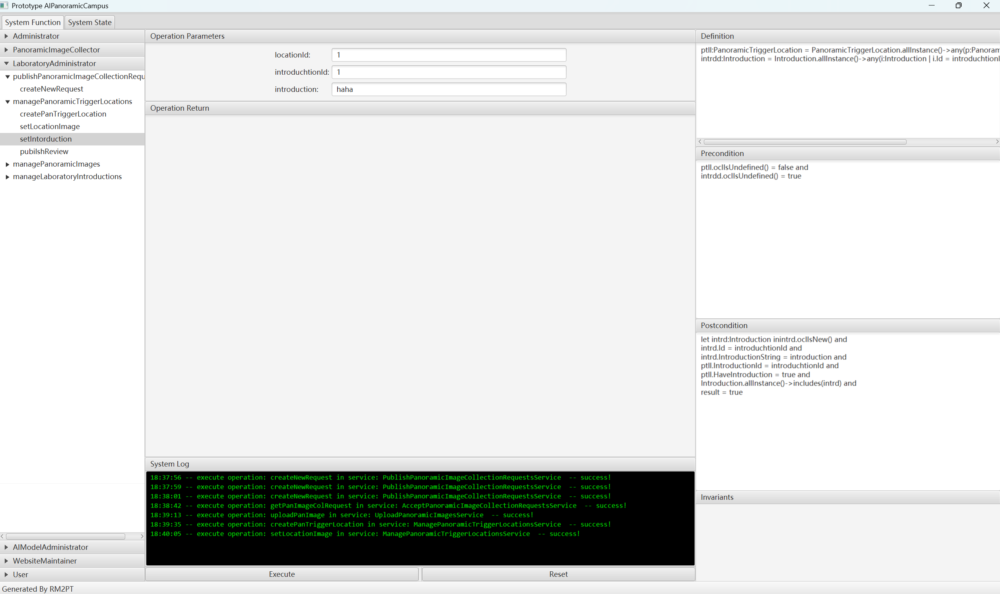
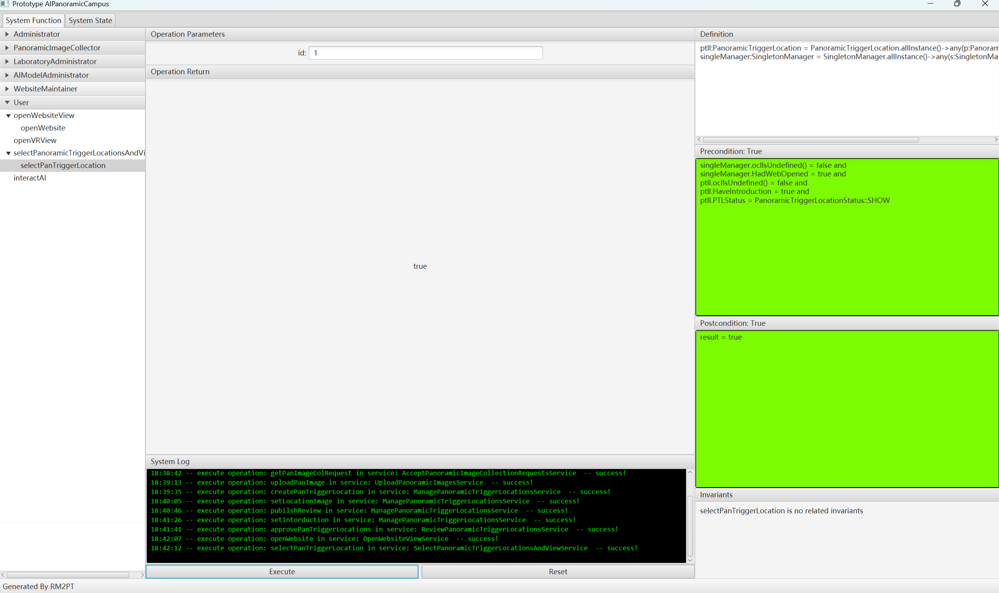

# lab01AIPanoramicCampus
软件需求与系统设计第一次课程作业
## 建模结果说明与截图

对实验室AI全景校园项目进行建模，用户包括管理员、全景采集者、实验室管理员、大模型管理员、网站维护者、用户。
预期效果是可接入VR的Web全景校园，用户可以点击交互点进行地点转移，进入设置好的实验室地点时，除了实验室的全景图片外，显示实验室信息。
同时将AI模型嵌入，LLM可以在用户提问时根据本地知识库进行回答，STT与TTS模型辅助用户更好地与AI交互。

## 模型规模说明
自然语言需求数量：用户16，系统38
Actor数量：6
用例数量：22
系统顺序图数量：7
系统操作总数：34
系统合约数量：34
类数量：17
## 需求原型化结果截图

