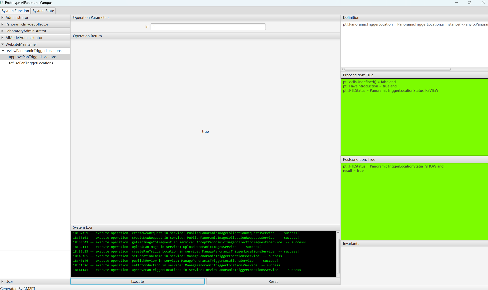
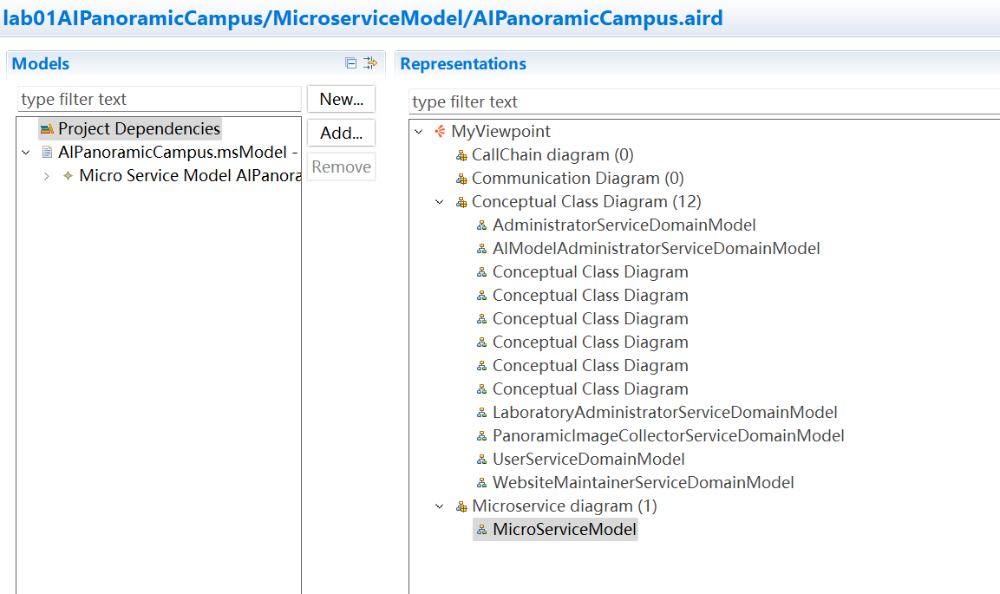

# lab01AIPanoramicCampus
软件需求与系统设计第一次课程作业
## 建模结果说明与截图

概念类图

对实验室AI全景校园项目进行建模，用户包括管理员、全景采集者、实验室管理员、大模型管理员、网站维护者、用户。

预期效果是可接入VR的Web全景校园，用户可以点击交互点进行地点转移，进入设置好的实验室地点时，除了实验室的全景图片外，显示实验室信息。

同时将AI模型嵌入，LLM可以在用户提问时根据本地知识库进行回答，STT与TTS模型辅助用户更好地与AI交互。


用例图
## 模型规模说明
自然语言需求数量：用户16，系统38

Actor数量：6

用例数量：22

系统顺序图数量：7

系统操作总数：34

系统合约数量：34

类数量：17
## 需求原型化结果截图

实验室管理员发布全景图片采集委托

全景采集者接取委托

全景采集者上传委托图片

实验室管理员创建实验室交互点

实验室管理员设置实验室的全景图片

实验室管理员设置实验室的介绍

实验室管理员提交审核

网站维护者进行审批

用户访问
# lab02
软件需求与系统设计第二次课程作业
## 架构设计自动生成
学习RapidMS工具后，使用工具生成第一次作业建模项目的架构设计模型与微服务模型

生成用例图

生成的类图

生成的微服务模型
## 面向对象详细自动生成
学习RM2DM工具后，使用工具生成第一次作业建模项目的详细设计模型

生成的详细设计类图
1[最后的文件夹结构](Image/2_5.png)
最后的文件夹结构
## 使用AI生成设计模型
如下是AI生成的类图：
```
+-----------------------------------+
|             Administrator         |
+-----------------------------------+
| - Id : Integer                    |
| - Passward : String               |
+-----------------------------------+
| + createLaboratoryAdministrator() |
| + queryLaboratoryAdministrator()  |
| + modifyLaboratoryAdministrator() |
| + deleteLaboratoryAdministrator() |
+-----------------------------------+

+-----------------------------------+
|        PanoramicImageCollector    |
+-----------------------------------+
| - Id : Integer                    |
| - Passward : String               |
+-----------------------------------+
| + createPanoramicImageCollector() |
| + queryPanoramicImageCollector()  |
| + modifyPanoramicImageCollector() |
| + deletePanoramicImageCollector() |
+-----------------------------------+

+-----------------------------------+
|       LaboratoryAdministrator     |
+-----------------------------------+
| - Id : Integer                    |
| - Passward : String               |
+-----------------------------------+
| + createLaboratoryAdministrator() |
| + queryLaboratoryAdministrator()  |
| + modifyLaboratoryAdministrator() |
| + deleteLaboratoryAdministrator() |
+-----------------------------------+

+-----------------------------------+
|        AIModelAdministrator       |
+-----------------------------------+
| - Id : Integer                    |
| - Passward : String               |
+-----------------------------------+
| + createAIModelAdministrator()    |
| + queryAIModelAdministrator()     |
| + modifyAIModelAdministrator()    |
| + deleteAIModelAdministrator()    |
+-----------------------------------+

+-----------------------------------+
|        WebsiteMaintainer          |
+-----------------------------------+
| - Id : Integer                    |
| - Passward : String               |
+-----------------------------------+
| + createWebsiteMaintainer()       |
| + queryWebsiteMaintainer()        |
| + modifyWebsiteMaintainer()       |
| + deleteWebsiteMaintainer()       |
+-----------------------------------+

+-----------------------------------+
|                User               |
+-----------------------------------+
| - Id : Integer                    |
+-----------------------------------+
| + openWebsiteView()               |
| + openVRView()                    |
| + selectPanoramicTriggerLocationsAndView() |
| + interactAI()                    |
+-----------------------------------+

+-----------------------------------+
|  PanoramicImageCollectionRequest  |
+-----------------------------------+
| - Id : Integer                    |
| - RequestStatus : PanImageColRequestStatus |
| - ImageId : Integer               |
+-----------------------------------+
| + createNewRequest()              |
| + getPanImageColRequest()         |
+-----------------------------------+

+-----------------------------------+
|          PanoramicImage           |
+-----------------------------------+
| - Id : Integer                    |
| - FilePath : String               |
+-----------------------------------+
| + uploadPanImage()                |
| + queryPanoramicImage()           |
| + modifyPanoramicImage()          |
| + deletePanoramicImage()          |
+-----------------------------------+

+-----------------------------------+
|      PanoramicTriggerLocation     |
+-----------------------------------+
| - Id : Integer                    |
| - PImageId : Integer              |
| - HaveIntroduction : Boolean      |
| - IntroductionId : Integer        |
| - PTLStatus : PanoramicTriggerLocationStatus |
+-----------------------------------+
| + createPanTriggerLocation()      |
| + setLocationImage()              |
| + setIntorduction()               |
| + pubilshReview()                 |
+-----------------------------------+

+-----------------------------------+
|           Introduction            |
+-----------------------------------+
| - Id : Integer                    |
| - IntroductionString : String     |
| - IntroductionWAVPath : String    |
+-----------------------------------+
| + createLaboratoryIntroduction()  |
| + queryLaboratoryIntroduction()   |
| + modifyLaboratoryIntroduction()  |
| + deleteLaboratoryIntroduction()  |
+-----------------------------------+

+-----------------------------------+
|             RAGFile               |
+-----------------------------------+
| - Id : Integer                    |
| - FilePath : String               |
+-----------------------------------+
| + createRAGDatabase()             |
| + queryRAGDatabase()              |
| + modifyRAGDatabase()             |
| + deleteRAGDatabase()             |
+-----------------------------------+

+-----------------------------------+
|               LLM                 |
+-----------------------------------+
| - Have : Boolean                  |
+-----------------------------------+
| + deployLLM()                     |
| + deleteDeployedLLM()             |
+-----------------------------------+

+-----------------------------------+
|               TTS                 |
+-----------------------------------+
| - Have : Boolean                  |
+-----------------------------------+
| + deployTTSModel()                |
| + deleteTTSModel()                |
+-----------------------------------+

+-----------------------------------+
|               STT                 |
+-----------------------------------+
| - Have : Boolean                  |
+-----------------------------------+
| + deploySTTModel()                |
| + deleteSTTModel()                |
+-----------------------------------+

+-----------------------------------+
|         SingletonManager          |
+-----------------------------------+
| - HadInited : Boolean             |
| - HadWebOpened : Boolean          |
| - HadVROpened : Boolean           |
+-----------------------------------+
| + openWebsite()                   |
+-----------------------------------+
```
如下是AI生成的服务：
```
+-----------------------------------+
| PublishPanoramicImageCollectionRequestsService |
+-----------------------------------+
| + createNewRequest(id : Integer) : Boolean |
+-----------------------------------+

+-----------------------------------+
| AcceptPanoramicImageCollectionRequestsService |
+-----------------------------------+
| + getPanImageColRequest(id : Integer) : Boolean |
+-----------------------------------+

+-----------------------------------+
| UploadPanoramicImagesService      |
+-----------------------------------+
| + uploadPanImage(imageId : Integer, requestId : Integer, imagePath : String) : Boolean |
+-----------------------------------+

+-----------------------------------+
| ManagePanoramicTriggerLocationsService |
+-----------------------------------+
| + createPanTriggerLocation(id : Integer) : Boolean |
| + setLocationImage(locationId : Integer, requestId : Integer) : Boolean |
| + setIntorduction(locationId : Integer, introduchtionId : Integer, introduction : String) : Boolean |
| + pubilshReview(locationId : Integer) : Boolean |
+-----------------------------------+

+-----------------------------------+
| ReviewPanoramicTriggerLocationsService |
+-----------------------------------+
| + approvePanTriggerLocations(id : Integer) : Boolean |
| + refusePanTriggerLocations(id : Integer) : Boolean |
+-----------------------------------+

+-----------------------------------+
| SelectPanoramicTriggerLocationsAndViewService |
+-----------------------------------+
| + selectPanTriggerLocation(id : Integer) : Boolean |
+-----------------------------------+

+-----------------------------------+
| OpenWebsiteViewService            |
+-----------------------------------+
| + openWebsite() : Boolean         |
+-----------------------------------+
```
如下是AI生成的数据模型设计：
```
+-----------------------------------+
|             Administrator         |
+-----------------------------------+
| - Id : Integer (Primary Key)      |
| - Passward : String               |
+-----------------------------------+

+-----------------------------------+
|        PanoramicImageCollector    |
+-----------------------------------+
| - Id : Integer (Primary Key)      |
| - Passward : String               |
+-----------------------------------+

+-----------------------------------+
|       LaboratoryAdministrator     |
+-----------------------------------+
| - Id : Integer (Primary Key)      |
| - Passward : String               |
+-----------------------------------+

+-----------------------------------+
|        AIModelAdministrator       |
+-----------------------------------+
| - Id : Integer (Primary Key)      |
| - Passward : String               |
+-----------------------------------+

+-----------------------------------+
|        WebsiteMaintainer          |
+-----------------------------------+
| - Id : Integer (Primary Key)      |
| - Passward : String               |
+-----------------------------------+

+-----------------------------------+
|                User               |
+-----------------------------------+
| - Id : Integer (Primary Key)      |
+-----------------------------------+

+-----------------------------------+
|  PanoramicImageCollectionRequest  |
+-----------------------------------+
| - Id : Integer (Primary Key)      |
| - RequestStatus : PanImageColRequestStatus |
| - ImageId : Integer (Foreign Key) |
+-----------------------------------+

+-----------------------------------+
|          PanoramicImage           |
+-----------------------------------+
| - Id : Integer (Primary Key)      |
| - FilePath : String               |
+-----------------------------------+

+-----------------------------------+
|      PanoramicTriggerLocation     |
+-----------------------------------+
| - Id : Integer (Primary Key)      |
| - PImageId : Integer (Foreign Key)|
| - HaveIntroduction : Boolean      |
| - IntroductionId : Integer (Foreign Key) |
| - PTLStatus : PanoramicTriggerLocationStatus |
+-----------------------------------+

+-----------------------------------+
|           Introduction            |
+-----------------------------------+
| - Id : Integer (Primary Key)      |
| - IntroductionString : String     |
| - IntroductionWAVPath : String    |
+-----------------------------------+

+-----------------------------------+
|             RAGFile               |
+-----------------------------------+
| - Id : Integer (Primary Key)      |
| - FilePath : String               |
+-----------------------------------+

+-----------------------------------+
|               LLM                 |
+-----------------------------------+
| - Id : Integer (Primary Key)      |
| - Have : Boolean                  |
+-----------------------------------+

+-----------------------------------+
|               TTS                 |
+-----------------------------------+
| - Id : Integer (Primary Key)      |
| - Have : Boolean                  |
+-----------------------------------+

+-----------------------------------+
|               STT                 |
+-----------------------------------+
| - Id : Integer (Primary Key)      |
| - Have : Boolean                  |
+-----------------------------------+

+-----------------------------------+
|         SingletonManager          |
+-----------------------------------+
| - Id : Integer (Primary Key)      |
| - HadInited : Boolean             |
| - HadWebOpened : Boolean          |
| - HadVROpened : Boolean           |
+-----------------------------------+
```
## 使用AI生成微服务模型

AI生成的微服务模型拆分
